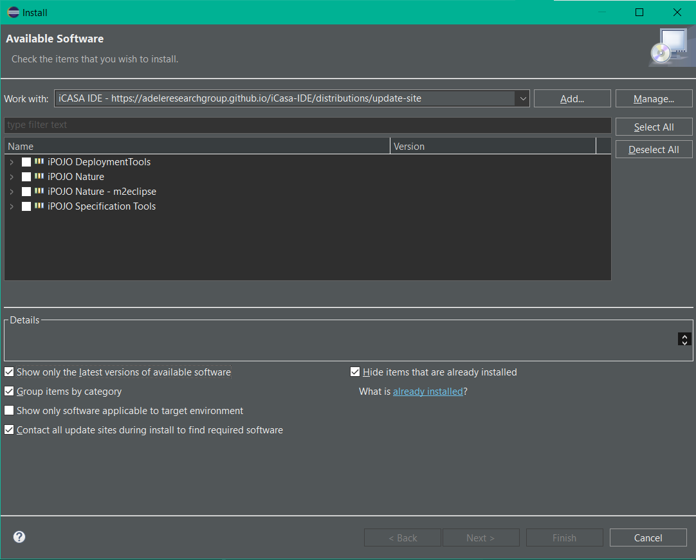

# Come installare iCasa su Eclipse

E' necessario installare su Eclipse le dipendenze iPOJO utilizzate da iCasa. Il procedimento è il seguente:

  1. Su Eclipse, andare su Help --> Install New Software.
  2. Cliccare il pulsante `Add`.
  3. Inserire un nome a scelta, l'importante e' che si inserisca il link [http://adeleresearchgroup.github.io/iCasa-IDE/distributions/update-site/%7D%7Bhttp://adeleresearchgroup.github.io/iCasa-IDE/distributions/update-site/](http://adeleresearchgroup.github.io/iCasa-IDE/distributions/update-site/%7D%7Bhttp://adeleresearchgroup.github.io/iCasa-IDE/distributions/update-site/). Questo link hosta le dipendenze che verranno scaricate.
  4. Selezionare tutti gli elementi corrispondenti a quelli mostrati nell'immagine.

  

  
  5. Procedere con l'installazione come indicato da Eclipse.

# Come implementare una nuova funzionalità

È possibile inserire nuovi dispositivi presenti nel simulatore seguendo questa procedura:
-  Modificare il file metadata.xml:
    *  Premere sul componente `InizializzaSistema`.
    *  Nella sezione `Required Servicies` premere `Add`.
    *  Nella schermata di Dependency Dialog bisogna inserire: 
        - Nome del dispositivo (al plurale se servono piu' dispositivi).
        - La cardinalita', che può essere 0-1, 0-n, 1-1, 1-n, dove il primo numero indica l'obbligatorietà mentre il secondo la cardinalità.
        - Il nome del metodo usato per fare il binding (ed il nome del metodo per fare unbinding).
        - La classe del dispositivo, che va scelta tra quelle disponibili su iCasa.
    * Infine, bisogna premere il tasto destro sul componente e scegliere la voce `Synchronize Implementation Class`, in questo modo nella classe `InizializzaSistemaImpl.java` verranno aggiunti i dispositivi indicati in precedenza e i metodi per fare bind/unbind.
         
- Creare una nuova classe `*NomeDispositivo*Listener.java` per aggiungere il listener del sensore utile al sistema da implementare, questa classe deve estendere `GenericListener.java`, in particolare, questa classe deve:
    * Implementare il metodo `verificaTipologiaDispositivo`, il quale controlla che il dispositivo attivato sia della classe java corretta.
    * Implementare il metodo `gestisciEvento`, nel quale bisogna gestire la logica del listener e chiamare i metodi della classe `Area` per invocare gli attuatori.
- Creare una nuova classe chiamata `Sistema*NomeSistema*.java`, che estende la classe astratta `Sistema`, in particolare, questa classe deve:
    * Implementare i metodi `assegnaListener` e `rimuoviListener`, dove assegnamo e rimuoviamo i listener ai dispositivi del simulatore, se ci sono.
    * Implementare i metodi `start` e `stop`, che gestiscono la logica di avvio e terminazione del sistema, in particolare annunciano che il sistema sta partendo o terminando ed assegnano o rimuovono i listener utili.
- Modificare la classe `Areabuilder.java`:
    * Inserire gli attributi relativi ai nuovi dispositivi
    * Creare un metodo per ogni attributo nuovo, che restituisca un oggetto di tipo AreaBuilder e che abbia come parametro un dispositivo dello stesso tipo del   nuovo attribuito. In questo metodo verrà assegnato al un nuovo attributo il dispositivo passato come parametro.
- Modificare la classe `Area.java`:
    * Aggiungere un nuovo attributo
    * Modificare il costruttore, in modo tale che dal builder venga preso anche il dispositivo nuovo e venga salvato nell'attributo appena creato.
    * Creare i dovuti getter e setter per questo attributo, se necessari.
- Modificare la classe `InizializzaSistemaImpl.java`:
    * Creare un nuovo attributo di tipo `Sistema*NomeSistema*.java`
    * Inserire la chiamata a `stop` della classe `Sistema*NomeSistema*` nel metodo stop di `InizializzaSistema.java`.
    * Nel metodo `start`, invece, bisogna:
        1. Recuperare gli attuatori e i sensori nuovi, tramite l'utilizzo dei metodi
           - `cercaDispositiviArea`, che restituisce una lista di dispositivi, utile per gli attuatori.
           - `cercaDispositivoArea` che restituisce un dispositivo, utile per i sensori.
           - Per i dispositivi che sono utili per diverse funzionalità, è presente anche un metodo `cercaDispositiviarea` che permette di specificare la tipologia del sistema con cui interagisce il dispositivo.
        2. Invocare i nuovi metodi del builder, per far sì che la costruzione dell'area avvenga correttamente.
        3. Istanziare il sistema appena creato
        4. Chiamare il metodo `start` subito dopo.
    * Infine, va gestita la logica dei nuovi dispositivi in `Area`.

# Come creare un nuovo file .jar

- Da Eclipse, tasto destro sul progetto > iCASA > Bundle Deployment

  

Se ci sono problemi durante la creazione del file .jar consultare la guida https://perso.telecom-paristech.fr/diacones/comasic/project-notes.html
